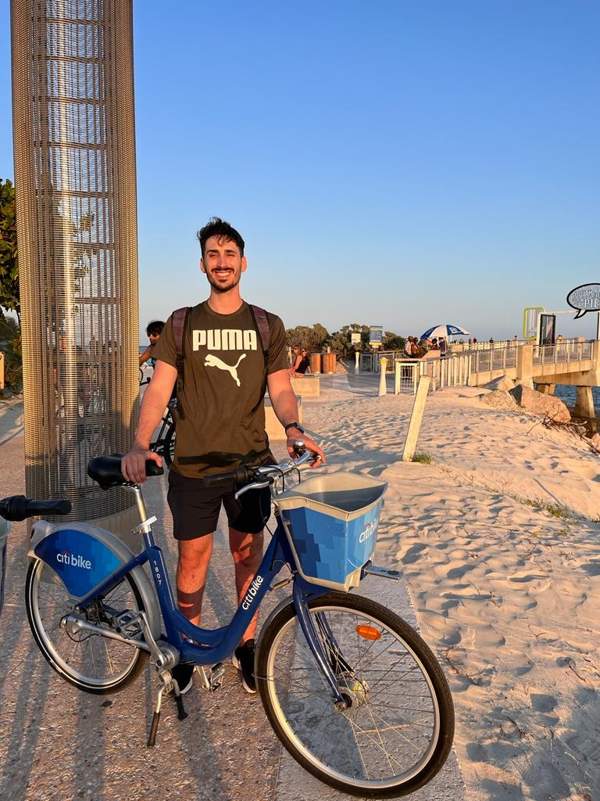

# Presentación

## Estudiante: Lucas Sordini

Buenas, Soy Lucas Sordini, tengo 30 años, vivo en Quilmes y trabajo en la cerveceria en el area de RRHH. Me encanta programar y aprender dia a dia cosas nuevas.
Lamentablemente me estoy sumando tarde a la cursada por un viaje de trabajo pero estoy con muchas ganas de arrancar.

- [ ] **Mirá la presentación de tus compas**. Una vez que terminaste, andá al [Github del curso](https://github.com/obj1unq) y mirá las presentaciones de tus compas. Haceles comentarios en la parte de _Issues_, despus volvé y respondé los issues de tu presentación.

